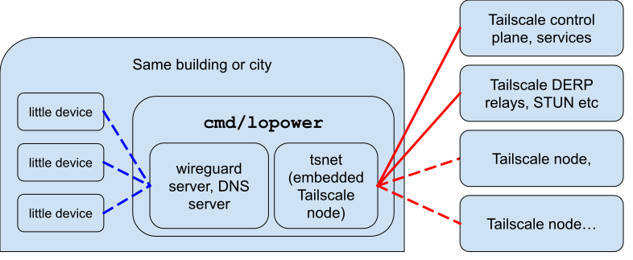

# Tailscale LOPOWER

"Little Opinionated Proxy Over Wireguard-encrypted Routes"

**STATUS**: in-development alpha (as of 2024-11-03)
 
## Background

Some small devices such as ESP32 microcontrollers [support WireGuard](https://github.com/ciniml/WireGuard-ESP32-Arduino) but are too small to run Tailscale.

Tailscale LOPOWER is a proxy that you run nearby that bridges a low-power WireGuard-speaking device on one side to Tailscale on the other side. That way network traffic from the low-powered device never hits the network unencrypted but is still able to communicate to/from other Tailscale devices on your Tailnet.

## Diagram

## Features

* Runs separate Wireguard server with separate keys (unknown to the Tailscale control plane) that proxy on to Tailscale
* Outputs WireGuard-standard configuration to enrolls devices, including in QR code form.
* embeds `tsnet`, with an identity on which the device(s) behind the proxy appear on your Tailnet
* optional IPv4 support. IPv6 is always enabled, as it never conflicts with anything. But IPv4 (or CGNAT) might already be in use on your client's network.
* includes a DNS server (at `fd7a:115c:a1e0:9909::1` by default and optionally also at `10.90.0.1`) to serve both MagicDNS names as well as forwarding non-Tailscale DNS names onwards
    * if IPv4 is disabled, MagicDNS `A` records are filtered out, and only `AAAA` records are served.

## Limitations

* this runs in userspace using gVisor's netstack. That means it's portable (and doesn't require kernel/system configuration), but that does mean it doesn't operate at a packet level but rather it stitches together two separate TCP (or UDP) flows and doesn't support IP protocols such as SCTP or other things that aren't TCP or UDP.
* the standard WireGuard configuration doesn't support specifying DNS search domains, so resolving bare names like the `go` in `http://go/foo` won't work and you need to resolve names using the fully qualified `go.your-tailnet.ts.net` names.
* since it's based on userspace tsnet mode, it doesn't pick up your system DNS configuration (yet?) and instead resolves non-tailnet DNS names using either your "Override DNS" tailnet settings for the global DNS resolver, or else defaults to `8.8.8.8` and `1.1.1.1` (using DoH) if that isn't set.

## TODO

* provisioning more than one low-powered device is possible, but requires manual config file edits. It should be possible to enroll multiple devices (including QR code support) easily.
* incoming connections (from Tailscale to `lopower`) don't yet forward to the low-powered devices. When there's only one low-powered device, the mapping policy is obvious. When there are multiple, it's not as obvious. Maybe the answer is supporting [4via6 subnet routers](https://tailscale.com/kb/1201/4via6-subnets).

## Installing

* git clone this repo, switch to `lp` branch, `go install ./cmd/lopower` and see `lopower --help`.
