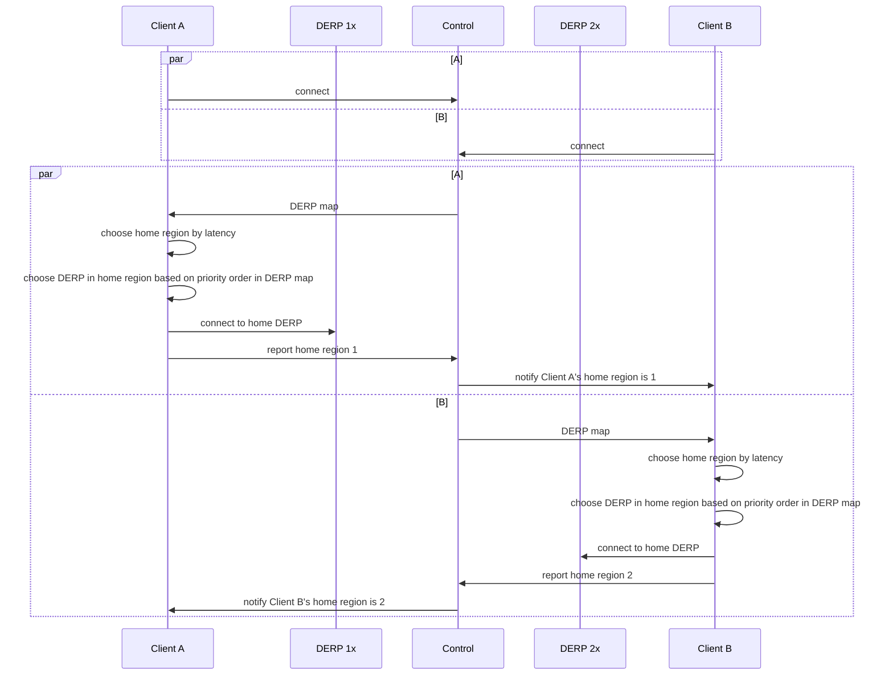
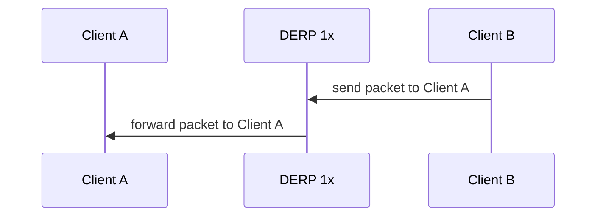
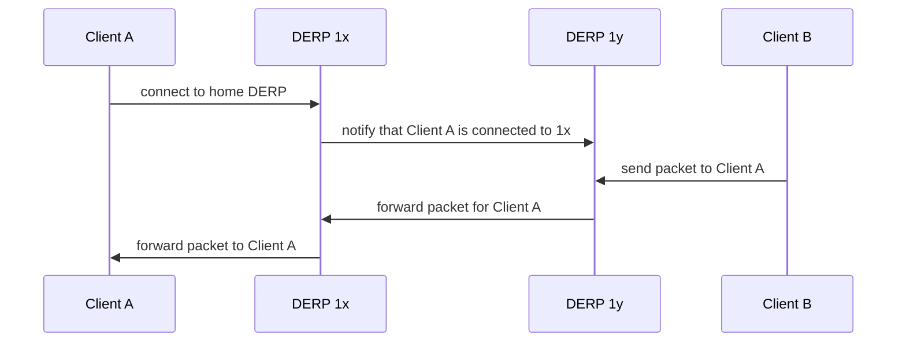
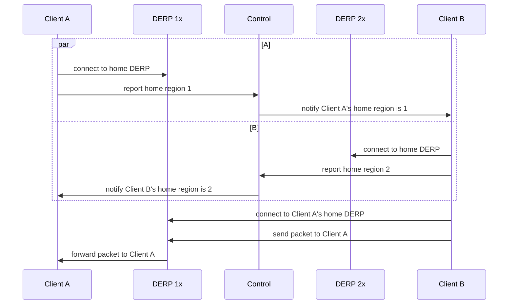

# DERP

This directory (and subdirectories) contain the DERP code. The server itself is
in `../cmd/derper`.

DERP is a packet relay system (client and servers) where peers are addressed
using WireGuard public keys instead of IP addresses.

It relays two types of packets:

* "Disco" discovery messages (see `../disco`) as the a side channel during [NAT
  traversal](https://tailscale.com/blog/how-nat-traversal-works/).

* Encrypted WireGuard packets as the fallback of last resort when UDP is blocked
  or NAT traversal fails.

## DERP Map

Each client receives a "[DERP
Map](https://pkg.go.dev/tailscale.com/tailcfg#DERPMap)" from the coordination
server describing the DERP servers the client should try to use.

The client picks its home "DERP home" based on latency. This is done to keep
costs low by avoid using cloud load balancers (pricey) or anycast, which would
necessarily require server-side routing between DERP regions.

Clients pick their DERP home and report it to the coordination server which
shares it to all the peers in the tailnet. When a peer wants to send a packet
and it doesn't already have a WireGuard session open, it sends disco messages
(some direct, and some over DERP), trying to do the NAT traversal. The client
will make connections to multiple DERP regions as needed. Only the DERP home
region connection needs to be alive forever.

## DERP Regions

Tailscale runs 1 or more DERP nodes (instances of `cmd/derper`) in various
geographic regions to make sure users have low latency to their DERP home.

Regions generally have multiple nodes per region "meshed" (routing to each
other) together for redundancy: it allows for cloud failures or upgrades without
kicking users out to a higher latency region. Instead, clients will reconnect to
the next node in the region. Each node in the region is required to to be meshed
with every other node in the region and forward packets to the other nodes in
the region. Packets are forwarded only one hop within the region. There is no
routing between regions. The assumption is that the mesh TCP connections are
over a VPC that's very fast, low latency, and not charged per byte. The
coordination server assigns the list of nodes in a region as a function of the
tailnet, so all nodes within a tailnet should generally be on the same node and
not require forwarding. Only after a failure do clients of a particular tailnet
get split between nodes in a region and require inter-node forwarding. But over
time it balances back out. There's also an admin-only DERP frame type to force
close the TCP connection of a particular client to force them to reconnect to
their primary if the operator wants to force things to balance out sooner.
(Using the `(*derphttp.Client).ClosePeer` method, as used by Tailscale's
internal rarely-used `cmd/derpprune` maintenance tool)

We generally run a minimum of three nodes in a region not for quorum reasons
(there's no voting) but just because two is too uncomfortably few for cascading
failure reasons: if you're running two nodes at 51% load (CPU, memory, etc) and
then one fails, that makes the second one fail. With three or more nodes, you
can run each node a bit hotter.

## Sequence Diagrams

The below sequence diagrams show some of the main DERP-related interactions.

### Connection Establishment

Tailscale clients connect to the control server and to their respective DERP homes. The control server distributes knowledge about chosen DERP homes to other clients.

At the end of this flow, both client A and client B are connected to their respective home DERPs 1x and 2x, and both know of each other's chosen DERP home region.

### Packet Sending, Same Home Region, Same Home DERP

This is the simplest case, in which both clients are already connected to the same DERP server.

### Packet Sending, Same Home Region, Different Home DERP (Mesh)

In this case, both clients are using the same home region, but they are connected to different DERP servers within this region.

### Packet Sending, Different Home Regions

In this case, both clients are using different home regions. The sending Client B connects to the recipients's home region.
Note that the Client B remains connected to its own home DERP even as it sends traffic to Client A via its home DERP region.

