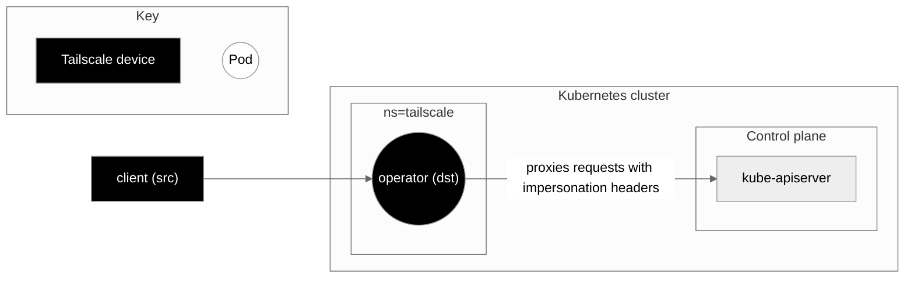
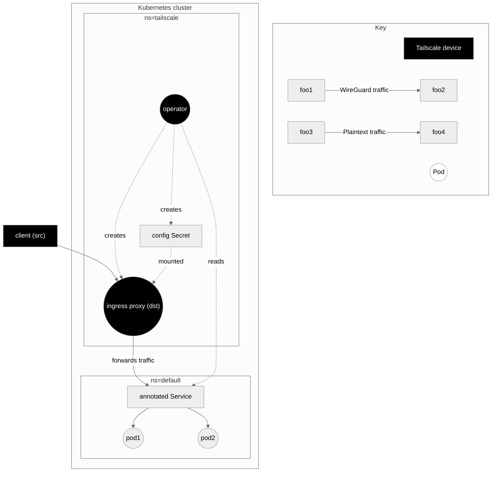
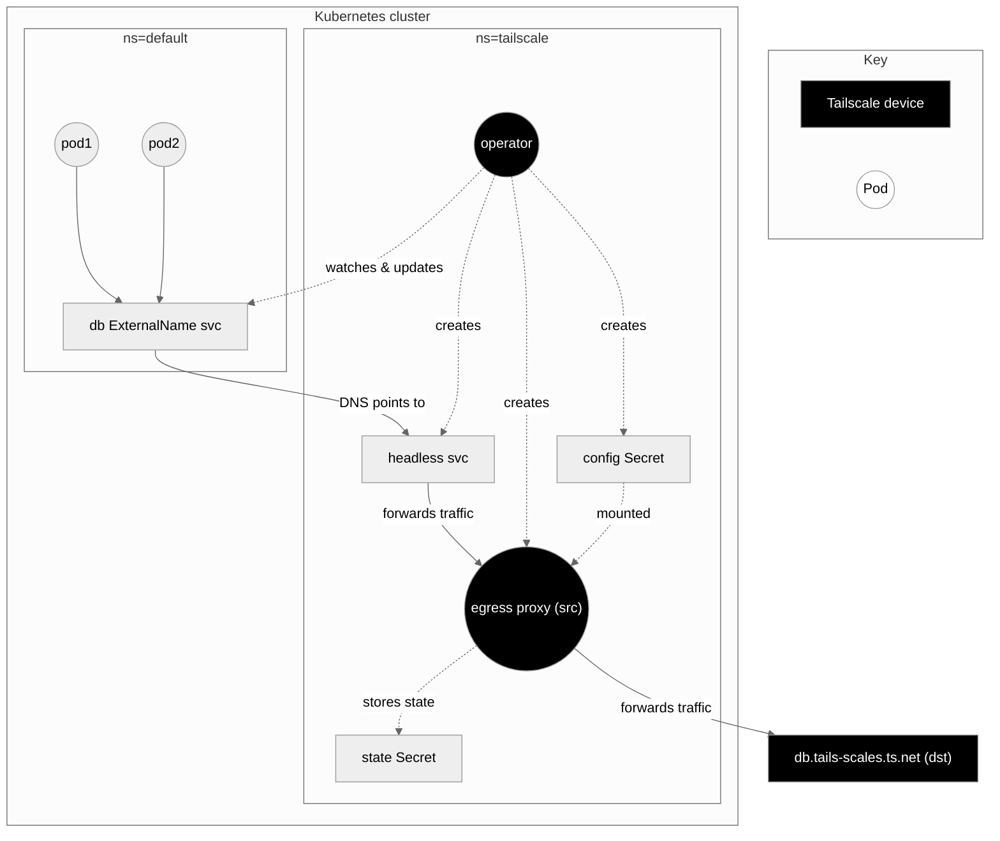
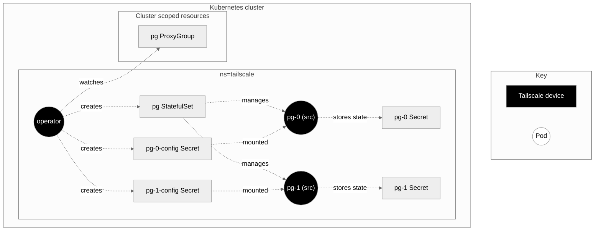
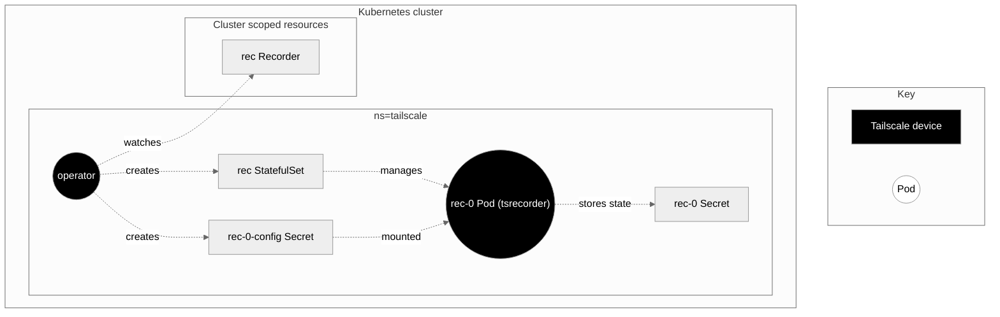

# Operator architecture diagrams

The Tailscale Kubernetes operator has a collection of use-cases that can be
mixed and matched as required. The following diagrams illustrate how the
operator implements each use-case.

In each diagram, the "tailscale" namespace is entirely managed by the operator
once the operator itself has been deployed.

Tailscale devices are highlighted as black nodes. The salient devices for each
use-case are marked as "src" or "dst" to denote which node is a source or a
destination in the context of ACL rules that will apply to network traffic.

## API server proxy

[Documentation][kb-operator-proxy]

The operator runs the API server proxy in-process. If the proxy is running in
"noauth" mode, it forwards HTTP requests unmodified. If the proxy is running in
"auth" mode, it deletes any existing auth headers and adds impersonation
headers to the request before forwarding to the API server.

## L3 ingress

[Documentation][kb-operator-l3-ingress]

The user deploys an app to the default namespace, and creates a normal Service
that selects the app's pods. Add the annotation `tailscale.com/expose: "true"`
to the Service, and the operator will create an ingress proxy that allows
devices anywhere on the tailnet to access the Service.

## L7 ingress

[Documentation][kb-operator-l7-ingress]

## L3 egress

[Documentation][kb-operator-l3-egress]

1. The user deploys a Service named `db` with `type: ExternalName` and an annotation 
  `tailscale.com/tailnet-fqdn: db.tails-scales.ts.net`.
1. The operator creates a proxy Pod managed by a single replica StatefulSet, and a headless Service pointing at the proxy Pod.
1. The operator updates the `db` Service's `spec.externalName` field to point
  at the headless Service it created in the previous step.

(Optional) If the user also adds the `tailscale.com/proxy-group: egress-proxies`
annotation to their `db` Service, the operator will skip creating a proxy Pod and
instead point the headless Service at the existing ProxyGroup's pods. In this
case, ports are also required in the `db` Service spec.

Note, in some cases, the config and the state Secret may be the same Kubernetes Secret.

## `ProxyGroup`

[Documentation][kb-operator-l3-egress-proxygroup]

The `ProxyGroup` custom resource manages a collection of proxy Pods that can be
configured to egress traffic out of the cluster via ExternalName Services defined
elsewhere. They will also support ingress in the future. In this diagram, the
`ProxyGroup` is named `pg`, and the operator creates proxy pods, via a StatefulSet
but they don't yet serve any traffic.

`ProxyGroups` currently only support egress (see above).

## Subnet routers and exit nodes

[Documentation][kb-operator-connector]

## Recorder nodes

[Documentation][kb-operator-recorder]

The `Recorder` custom resource makes it easier to deploy `tsrecorder` to a cluster.
It currently only supports a single replica.

[kb-operator-proxy]: https://tailscale.com/kb/1437/kubernetes-operator-api-server-proxy
[kb-operator-l3-ingress]: https://tailscale.com/kb/1439/kubernetes-operator-cluster-ingress#exposing-a-cluster-workload-using-a-kubernetes-service
[kb-operator-l7-ingress]: https://tailscale.com/kb/1439/kubernetes-operator-cluster-ingress#exposing-cluster-workloads-using-a-kubernetes-ingress
[kb-operator-l3-egress]: https://tailscale.com/kb/1438/kubernetes-operator-cluster-egress
[kb-operator-l3-egress-proxygroup]: TODO
[kb-operator-connector]: https://tailscale.com/kb/1441/kubernetes-operator-connector
[kb-operator-recorder]: TODO
