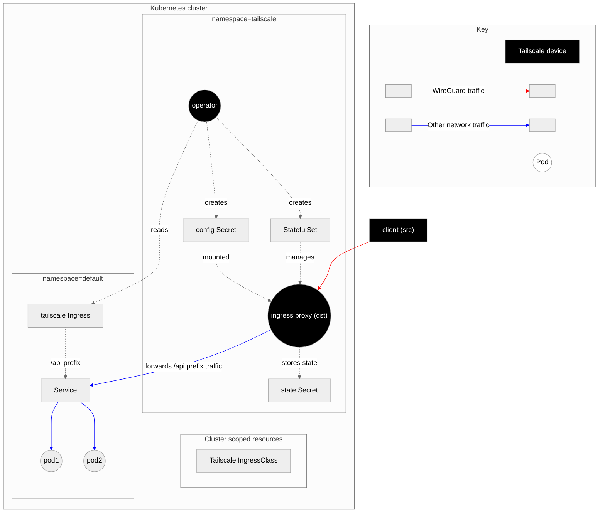

# Operator architecture diagrams

The Tailscale [Kubernetes operator][kb-operator] has a collection of use-cases
that can be mixed and matched as required. The following diagrams illustrate
how the operator implements each use-case.

In each diagram, the "tailscale" namespace is entirely managed by the operator
once the operator itself has been deployed.

Tailscale devices are highlighted as black nodes. The salient devices for each
use-case are marked as "src" or "dst" to denote which node is a source or a
destination in the context of ACL rules that will apply to network traffic.

Note, in some cases, the config and the state Secret may be the same Kubernetes
Secret.

## API server proxy

[Documentation][kb-operator-proxy]

The operator runs the API server proxy in-process. If the proxy is running in
"noauth" mode, it forwards HTTP requests unmodified. If the proxy is running in
"auth" mode, it deletes any existing auth headers and adds
[impersonation headers][k8s-impersonation] to the request before forwarding to
the API server. A request with impersonation headers will look something like:

```
GET /api/v1/namespaces/default/pods HTTP/1.1
Host: k8s-api.example.com
Authorization: Bearer <operator-service-account-token>
Impersonate-Group: tailnet-readers
Accept: application/json
```


## L3 ingress

[Documentation][kb-operator-l3-ingress]

The user deploys an app to the default namespace, and creates a normal Service
that selects the app's Pods. Either add the annotation
`tailscale.com/expose: "true"` or specify `.spec.type` as `Loadbalancer` and
`.spec.loadBalancerClass` as `tailscale`. The operator will create an ingress
proxy that allows devices anywhere on the tailnet to access the Service.

The proxy Pod uses `iptables` or `nftables` rules to DNAT traffic bound for the
proxy's tailnet IP to the Service's internal Cluster IP instead.


## L7 ingress

[Documentation][kb-operator-l7-ingress]

The L7 ingress architecture diagram is relatively similar to L3 ingress. It is
configured via an `Ingress` object instead of a `Service`, and uses
`tailscale serve` to accept traffic instead of configuring `iptables` or
`nftables` rules. Note that we use tailscaled's local API (`SetServeConfig`) to
set serve config, not the `tailscale serve` command.



## L3 egress

[Documentation][kb-operator-l3-egress]

1. The user deploys a Service with `type: ExternalName` and an annotation 
  `tailscale.com/tailnet-fqdn: db.tails-scales.ts.net`.
1. The operator creates a proxy Pod managed by a single replica StatefulSet, and a headless Service pointing at the proxy Pod.
1. The operator updates the `ExternalName` Service's `spec.externalName` field to point
  at the headless Service it created in the previous step.

(Optional) If the user also adds the `tailscale.com/proxy-group: egress-proxies`
annotation to their `ExternalName` Service, the operator will skip creating a
proxy Pod and instead point the headless Service at the existing ProxyGroup's
pods. In this case, ports are also required in the `ExternalName` Service spec.
See below for a more representative diagram.


## `ProxyGroup`

### Egress

[Documentation][kb-operator-l3-egress-proxygroup]

The `ProxyGroup` custom resource manages a collection of proxy Pods that
can be configured to egress traffic out of the cluster via ExternalName
Services. A `ProxyGroup` is both a high availability (HA) version of L3
egress, and a mechanism to serve multiple ExternalName Services on a single
set of Tailscale devices (coalescing).

In this diagram, the `ProxyGroup` is named `pg`. The Secrets associated with
the `ProxyGroup` Pods are omitted for simplicity. They are similar to the L3
egress case above, but there is a pair of config + state Secrets _per Pod_.

Each ExternalName Service defines which ports should be mapped to their defined
egress target. The operator maps from these ports to randomly chosen ephemeral
ports via the ClusterIP Service and its EndpointSlice. The operator then
generates the egress ConfigMap that tells the `ProxyGroup` Pods which incoming
ports map to which egress targets.


### Ingress

A ProxyGroup can also serve as a highly available set of proxies for an
Ingress resource. The `-0` Pod is always the replica that will issue a certificate
from Let's Encrypt.

If the same Ingress config is applied in multiple clusters, ProxyGroup proxies
from each cluster will be valid targets for the ts.net DNS name, and the proxy
each client is routed to will depend on the same rules as for [high availability][kb-ha]
subnet routers, and is encoded in the client's netmap.


## Connector

[Subnet router and exit node documentation][kb-operator-connector]

[App connector documentation][kb-operator-app-connector]

The Connector Custom Resource can deploy either a subnet router, an exit node,
or an app connector. The following diagram shows all 3, but only one workflow
can be configured per Connector resource.


## Recorder nodes

[Documentation][kb-operator-recorder]

The `Recorder` custom resource makes it easier to deploy `tsrecorder` to a cluster.
It currently only supports a single replica.


[kb-operator]: https://tailscale.com/kb/1236/kubernetes-operator
[kb-operator-proxy]: https://tailscale.com/kb/1437/kubernetes-operator-api-server-proxy
[kb-operator-l3-ingress]: https://tailscale.com/kb/1439/kubernetes-operator-cluster-ingress#exposing-a-cluster-workload-using-a-kubernetes-service
[kb-operator-l7-ingress]: https://tailscale.com/kb/1439/kubernetes-operator-cluster-ingress#exposing-cluster-workloads-using-a-kubernetes-ingress
[kb-operator-l3-egress]: https://tailscale.com/kb/1438/kubernetes-operator-cluster-egress
[kb-operator-l3-egress-proxygroup]: https://tailscale.com/kb/1438/kubernetes-operator-cluster-egress#configure-an-egress-service-using-proxygroup
[kb-operator-connector]: https://tailscale.com/kb/1441/kubernetes-operator-connector
[kb-operator-app-connector]: https://tailscale.com/kb/1517/kubernetes-operator-app-connector
[kb-operator-recorder]: https://tailscale.com/kb/1484/kubernetes-operator-deploying-tsrecorder
[kb-ha]: https://tailscale.com/kb/1115/high-availability
[k8s-impersonation]: https://kubernetes.io/docs/reference/access-authn-authz/authentication/#user-impersonation
